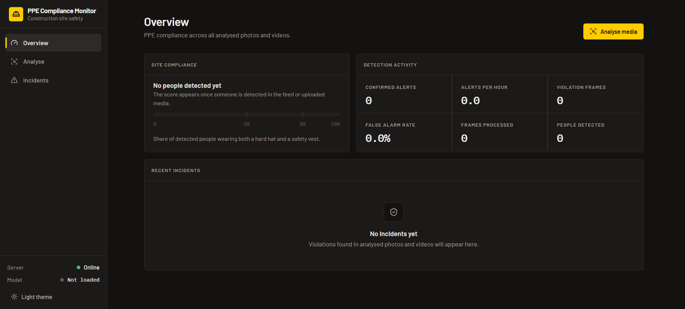
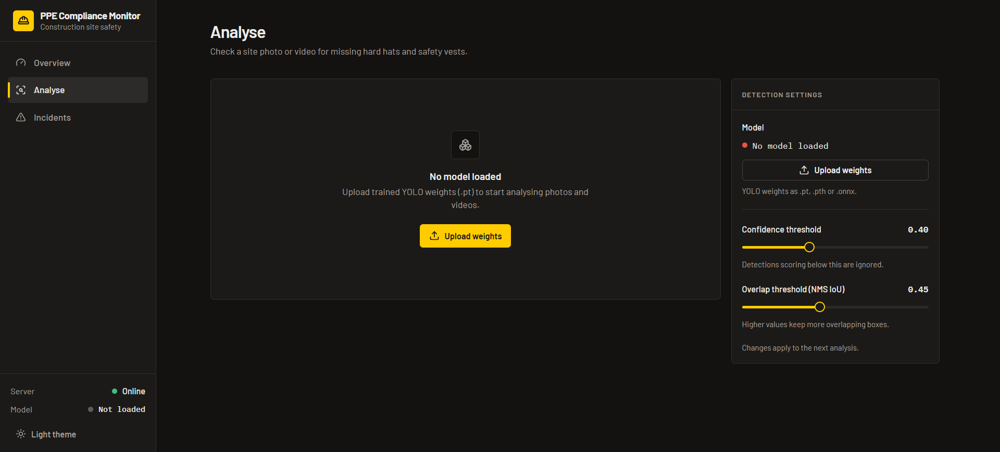
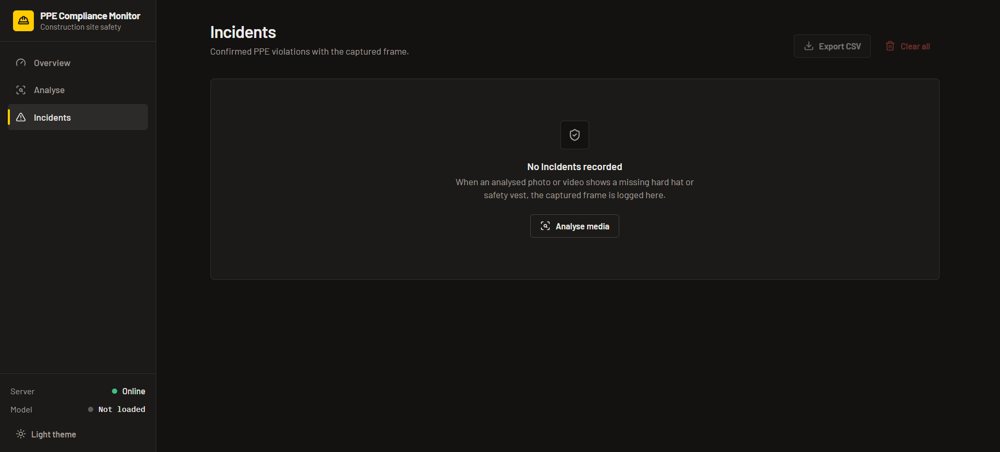

# PPE Compliance Monitor

A real-time Personal Protective Equipment (PPE) compliance monitoring system that uses computer vision and deep learning to detect safety violations in construction and industrial environments. Built with a YOLOv8-based detection model, FastAPI backend, and a modern React frontend.

## Screenshots

### Overview

Site compliance score, detection activity counters and recent incidents.



### Analyse

Upload model weights, tune the confidence and overlap thresholds, then analyse a site photo or video.



### Incidents

Confirmed PPE violations with the captured frame, exportable as CSV.



## Features

### Core Detection Capabilities

- **Real-time PPE Detection**: Identifies 10 different classes including:
  - Hardhat / NO-Hardhat
  - Mask / NO-Mask
  - Safety Vest / NO-Safety Vest
  - Person, Safety Cone, Machinery, Vehicle
- **Image & Video Processing**: Support for both single image uploads and video file analysis
- **Temporal Consistency**: 5-frame temporal buffering to reduce false positives
- **Violation Overlay**: Automatic annotation of detected violations with bounding boxes

### Monitoring & Analytics

- **Safety Score Dashboard**: Real-time compliance percentage
- **Detection Metrics**: mAP@0.5 accuracy, alerts per hour, false alarm rate
- **Incident Logging**: Automatic capture and storage of violation frames
- **Session Persistence**: Complete state recovery across page reloads

### System Features

- **Async Video Processing**: Background job processing for large video files
- **Dark/Light Mode**: Theme switching with persistent preference
- **Configurable Thresholds**: Adjustable confidence and NMS IoU thresholds
- **Model Hot-swapping**: Runtime model weight updates via file upload
- **CORS Enabled**: Multi-origin support for local development

## Tech Stack

| Component            | Technology                          |
| -------------------- | ----------------------------------- |
| **Detection Model**  | YOLOv8 (Ultralytics)                |
| **Backend**          | FastAPI + Uvicorn                   |
| **Frontend**         | React 18 + TypeScript               |
| **Build Tool**       | Vite 5                              |
| **Styling**          | Tailwind CSS 3.4                    |
| **UI Components**    | Radix UI + shadcn/ui                |
| **Icons**            | Lucide React                        |
| **State Management** | React Context + Backend Persistence |

## Quick Start

### Prerequisites

- Windows 10 or 11
- Node.js 18+
- Python 3.10+ on `PATH` (the `py` launcher or `python`)

### Run

From the repository root:

```powershell
npm run dev
```

That single command works on a fresh clone and on an existing setup. It:

1. **Sets up what is missing, once.** It installs the frontend packages, creates `.venv` at the root, installs `Backend/requirements.txt` into it, and copies each `.env.example` to `.env`. Every step records a hash of its source file (`package-lock.json`, `requirements.txt`), so later runs skip it unless that file changes. The first run downloads PyTorch and can take several minutes.
2. **Opens two log windows**: _Backend logs_ (FastAPI on `http://localhost:8000`) and _Frontend logs_ (Vite on `http://localhost:8080`). Backend request logs are timestamped and hide successful calls to the endpoints the UI polls, so uploads, errors and warnings stand out.
3. **Keeps the terminal you ran it in as the controller.** It waits for both services, opens the app in your browser, and reports status. Press **Ctrl+C** there to stop both services and close their windows. Closing either log window also stops everything.

If port 8000 or 8080 is already taken, it names the process holding the port and exits without starting anything.

### Model weights

The trained weights (`best.pt`) are not in the repository. Place them at `Backend/Trained Weights/best.pt` (or set `MODEL_PATH` in `Backend/.env`) and restart. Alternatively, upload a `.pt` file from the **Analyse** page while the app is running. Until weights are loaded, the app runs but detection is unavailable.

### Running the services manually

```powershell
# Backend
cd Backend
..\.venv\Scripts\python.exe -u api.py

# Frontend (separate terminal)
cd Frontend
npm run dev
```

## API Endpoints

### Health & Configuration

| Method | Endpoint                 | Description                 |
| ------ | ------------------------ | --------------------------- |
| GET    | `/api/health`            | Health check & model status |
| GET    | `/api/config`            | Get current configuration   |
| POST   | `/api/config/thresholds` | Update detection thresholds |

### Detection

| Method | Endpoint                     | Description                  |
| ------ | ---------------------------- | ---------------------------- |
| POST   | `/api/detect/image`          | Process single image         |
| POST   | `/api/detect/video`          | Start async video processing |
| GET    | `/api/detect/video/{job_id}` | Check video job status       |

### Data & Metrics

| Method | Endpoint               | Description             |
| ------ | ---------------------- | ----------------------- |
| GET    | `/api/metrics`         | Get session metrics     |
| GET    | `/api/incidents`       | Get all incidents       |
| DELETE | `/api/incidents/clear` | Clear all incidents     |
| GET    | `/api/session`         | Get saved session state |
| POST   | `/api/session`         | Save session state      |
| DELETE | `/api/session`         | Clear session state     |

### Model Management

| Method | Endpoint            | Description                     |
| ------ | ------------------- | ------------------------------- |
| POST   | `/api/model/reload` | Upload and reload model weights |

### Static Files

| Endpoint                           | Description             |
| ---------------------------------- | ----------------------- |
| `/api/videos/{filename}`           | Serve uploaded videos   |
| `/api/incidents/images/{filename}` | Serve incident captures |

## Model Classes

| Class          | Type       | Description                                        |
| -------------- | ---------- | -------------------------------------------------- |
| Hardhat        | Compliance | Worker wearing hard hat                            |
| Mask           | Compliance | Worker wearing face mask                           |
| NO-Hardhat     | Violation  | Worker missing hard hat                            |
| NO-Mask        | Advisory   | Worker missing mask (reported, raises no incident) |
| NO-Safety Vest | Violation  | Worker missing safety vest                         |
| Person         | Neutral    | Detected person                                    |
| Safety Cone    | Neutral    | Safety cone object                                 |
| Safety Vest    | Compliance | Worker wearing safety vest                         |
| machinery      | Neutral    | Heavy machinery                                    |
| vehicle        | Neutral    | Vehicle in scene                                   |

## Configuration

### Backend Environment Variables (`Backend/.env`)

| Variable           | Default                                                             | Description                            |
| ------------------ | ------------------------------------------------------------------- | -------------------------------------- |
| `API_KEY`          | -                                                                   | Optional API key for authentication    |
| `ALLOWED_ORIGINS`  | `http://localhost:3000,http://localhost:5173,http://localhost:8080` | CORS origins                           |
| `MODEL_PATH`       | `Trained Weights/best.pt`                                           | Path to YOLO weights                   |
| `CLASS_NAMES_FILE` | `Trained Weights/ppe_data.yaml`                                     | Dataset YAML the class names come from |
| `DATA_DIR`         | `data`                                                              | Runtime data folder                    |
| `MAX_UPLOAD_SIZE`  | `52428800` (50MB)                                                   | Max upload file size                   |
| `HOST` / `PORT`    | `0.0.0.0` / `8000`                                                  | Address the API listens on             |

Relative paths resolve against `Backend/`. Invalid values stop the backend at startup.

### Frontend Environment Variables (`Frontend/.env`)

| Variable            | Default                     | Description     |
| ------------------- | --------------------------- | --------------- |
| `VITE_API_BASE_URL` | `http://localhost:8000/api` | Backend API URL |

## Detection Thresholds

Adjustable via the Settings UI or `/api/config/thresholds`:

- **Confidence Threshold**: 0.1 - 0.95 (default: 0.40)
  - Minimum confidence score for a detection to be accepted
  - Higher values = fewer detections, more precise

- **NMS IoU Threshold**: 0.1 - 0.95 (default: 0.45)
  - Intersection-over-Union threshold for non-maximum suppression
  - Higher values = more overlapping boxes allowed

## Data Persistence

All runtime data is stored in `Backend/data/`:

- **incidents.json**: Violation records with metadata
- **metrics.json**: Computed session statistics
- **session_state.json**: UI state (dark mode, thresholds, video progress)
- **video_jobs.json**: Pending/processing video jobs

Session state is automatically saved on every change and restored on application load.

## Video Processing

Videos are processed asynchronously:

1. Upload triggers a background job that runs in a worker thread, off the event loop
2. Job ID returned immediately (jobs live in memory, so a backend restart forgets running jobs)
3. Frontend polls `/api/detect/video/{job_id}` every 2 seconds
4. Progress updates in real-time
5. Completion triggers incident/metrics refresh

Large videos (up to configured max size) are supported via chunked reading and periodic yield to prevent blocking.

## Model Training

The detection model was trained using the `Construction-Site-Safety.ipynb` notebook on Kaggle with dual Tesla T4 GPUs. Below are the complete training details, dataset statistics, and performance metrics.

### Dataset

**Source**: Construction Site Safety Image Dataset (Roboflow)

| Split      | Images    | Annotations |
| ---------- | --------- | ----------- |
| Train      | 2,240     | 30,684      |
| Validation | 280       | 3,554       |
| Test       | 281       | 4,114       |
| **Total**  | **2,801** | **38,352**  |

**Class Distribution (annotations)**:

| Class          | Train | Val | Test  | Total |
| -------------- | ----- | --- | ----- | ----- |
| Person         | 7,908 | 923 | 1,041 | 9,872 |
| machinery      | 4,274 | 505 | 567   | 5,346 |
| NO-Safety Vest | 3,269 | 422 | 467   | 4,158 |
| Safety Cone    | 2,782 | 337 | 383   | 3,502 |
| Hardhat        | 2,667 | 276 | 391   | 3,334 |
| NO-Mask        | 2,634 | 282 | 334   | 3,250 |
| Safety Vest    | 2,556 | 266 | 313   | 3,135 |
| NO-Hardhat     | 1,943 | 225 | 259   | 2,427 |
| Mask           | 1,346 | 168 | 186   | 1,700 |
| vehicle        | 1,305 | 150 | 173   | 1,628 |

### Training Configuration

**Model Architecture**: YOLOv8m (medium)

**Hyperparameters**:

| Parameter       | Value              | Description               |
| --------------- | ------------------ | ------------------------- |
| Epochs          | 100                | Training iterations       |
| Image Size      | 640px              | Input resolution          |
| Batch Size      | 32                 | 16 per GPU on dual T4s    |
| Initial LR      | 0.01               | Starting learning rate    |
| Final LR        | 0.01 × 0.01 = 1e-4 | Cosine decay floor        |
| Momentum        | 0.937              | SGD momentum              |
| Weight Decay    | 0.0005             | L2 regularization         |
| Warmup Epochs   | 3.0                | Linear warmup period      |
| Cosine LR       | True               | Cosine annealing schedule |
| Patience        | 30                 | Early stopping patience   |
| Label Smoothing | 0.1                | Regularization technique  |

**Augmentation Settings**:

| Parameter      | Value | Description                 |
| -------------- | ----- | --------------------------- |
| HSV Hue        | 0.015 | Color jitter (hue)          |
| HSV Saturation | 0.7   | Color jitter (saturation)   |
| HSV Value      | 0.4   | Color jitter (brightness)   |
| Degrees        | 5.0   | Rotation range (±degrees)   |
| Translate      | 0.1   | Translation factor          |
| Scale          | 0.5   | Scale jitter (±50%)         |
| Shear          | 2.0   | Shear range                 |
| Flip LR        | 0.5   | Horizontal flip probability |
| Mosaic         | 1.0   | Mosaic augmentation         |
| Mixup          | 0.1   | Mixup augmentation          |
| Copy-Paste     | 0.1   | Copy-paste augmentation     |
| Close Mosaic   | 10    | Disable mosaic final epochs |

**Training Hardware**:

- 2× NVIDIA Tesla T4 (16GB VRAM each)
- CUDA 13.0
- PyTorch 2.10.0
- Ultralytics 8.4.30

**Runtime**: 72.0 minutes training time (72.7 min total)

### Training Results

**Best Epoch**: 88 (mAP@0.5 = 0.8786)

**Final Training Epoch (Epoch 100)**:

- Train Box Loss: 0.59277
- Train Class Loss: 0.35172
- Precision: 0.91597
- Recall: 0.81265
- mAP@0.5: 0.87485
- mAP@0.5:0.95: 0.65057

### Validation Results

| Metric          | Value        |
| --------------- | ------------ |
| mAP@0.5         | 0.8784       |
| mAP@0.5:0.95    | 0.6543       |
| Precision       | 0.9222       |
| Recall          | 0.8129       |
| Inference Speed | 23.0ms/image |

**Per-Class AP@0.5 (Validation)**:

| Class          | AP@0.5 | AP@0.5:0.95 |
| -------------- | ------ | ----------- |
| Mask           | 0.9734 | 0.7702      |
| machinery      | 0.9653 | 0.8499      |
| Person         | 0.9394 | 0.7538      |
| NO-Safety Vest | 0.9136 | 0.6921      |
| NO-Hardhat     | 0.8787 | 0.6194      |
| Hardhat        | 0.8751 | 0.6383      |
| vehicle        | 0.8570 | 0.6394      |
| Safety Vest    | 0.8486 | 0.6426      |
| NO-Mask        | 0.8127 | 0.5206      |
| Safety Cone    | 0.7204 | 0.4168      |

### Test Results (Final Evaluation)

| Metric          | Value        |
| --------------- | ------------ |
| mAP@0.5         | 0.8807       |
| mAP@0.5:0.95    | 0.6425       |
| Precision       | 0.9227       |
| Recall          | 0.8092       |
| Inference Speed | 23.5ms/image |

**Per-Class AP@0.5 (Test)**:

| Class          | AP@0.5 | AP@0.5:0.95 |
| -------------- | ------ | ----------- |
| machinery      | 0.9640 | 0.8448      |
| Mask           | 0.9548 | 0.7431      |
| Person         | 0.9338 | 0.7355      |
| vehicle        | 0.9057 | 0.7229      |
| NO-Safety Vest | 0.8917 | 0.6699      |
| NO-Hardhat     | 0.8762 | 0.6146      |
| Safety Vest    | 0.8505 | 0.6207      |
| NO-Mask        | 0.8298 | 0.4888      |
| Hardhat        | 0.8276 | 0.5767      |
| Safety Cone    | 0.7725 | 0.4081      |

### Model Export

The trained model was exported to ONNX format for optimized inference:

- **Format**: ONNX (opset 17)
- **Input Shape**: (1, 3, 640, 640) BCHW
- **Output Shape**: (1, 14, 8400)
- **Simplified**: Yes (using onnxslim)
- **File Size**: 98.8 MB (ONNX), 49.6 MB (PyTorch)

### Key Findings

1. **High Performance on Safety-Critical Classes**: The model achieves >95% AP on Mask detection and >96% AP on machinery detection, which are critical for construction site safety.

2. **Balanced Violation Detection**: Both violation classes (NO-Hardhat, NO-Mask, NO-Safety Vest) and compliance classes (Hardhat, Mask, Safety Vest) show strong performance (>82% AP on test set).

3. **Challenging Classes**: Safety Cone shows lower performance (~77% AP on test) likely due to smaller size and higher variability in appearance.

4. **Efficient Inference**: ~23ms per image on Tesla T4 enables real-time processing at 40+ FPS.

5. **Training Stability**: Best performance achieved at epoch 88; early stopping patience of 30 epochs prevented overfitting while allowing full convergence.

## Development Notes

### Model Training

The included Jupyter notebook `Construction-Site-Safety.ipynb` contains the full training pipeline:

- Dataset preparation and augmentation
- YOLOv8 model configuration
- Training loop with validation
- Export to ONNX/torchscript formats

### Code Quality

Run every check with one command from the repository root:

```bash
npm run check
```

It runs ESLint (including module boundary rules), the TypeScript check, Prettier, the jscpd duplicate-code check, the Vite build, Black, import-linter layer contracts, and the backend pytest suite. CI (`.github/workflows/ci.yml`) runs the same command. The module layout and dependency rules are in [ARCHITECTURE.md](ARCHITECTURE.md).

### Browser Support

- Chrome 90+
- Firefox 88+
- Edge 90+
- Safari 14+

## Troubleshooting

| Issue             | Solution                                                                  |
| ----------------- | ------------------------------------------------------------------------- |
| Model not loading | Check `MODEL_PATH` in `.env`, ensure `best.pt` exists                     |
| CORS errors       | Verify `ALLOWED_ORIGINS` includes frontend URL                            |
| Upload failures   | Check `MAX_UPLOAD_SIZE` for large files                                   |
| Port conflicts    | `npm run dev` names the process holding port 8000/8080; stop it and rerun |
| Memory issues     | Reduce video resolution or process shorter clips                          |
